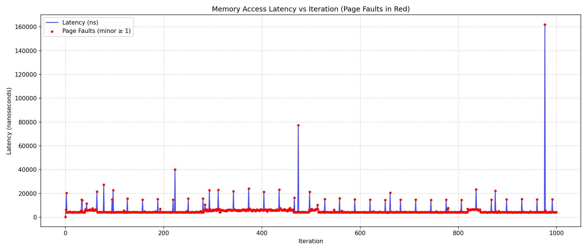
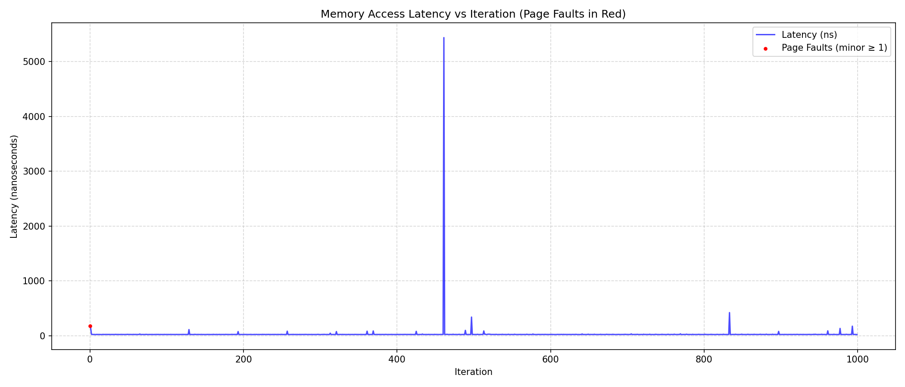

# Отчёт по практическому заданию 5: Управление памятью в системах реального времени

---

## Введение

В системах реального времени (СРВ) критически важна **предсказуемость** и **детерминированность** выполнения операций. Одним из основных источников непредсказуемых задержек является работа с памятью — в частности, **page faults** при использовании `malloc` и неэффективное управление памятью.

В данном отчёте представлены результаты трёх заданий:
1. Демонстрация влияния page faults на латентность доступа к памяти.
2. Устранение page faults с помощью `mlockall` и pre-faulting.
3. Реализация и бенчмарк собственного пула памяти, сравнение с `malloc`.

Цель — показать, как можно добиться стабильной и предсказуемой работы с памятью в СРВ.

---

## Задание 1: Демонстрация влияния Page Faults

### Цель
Показать, что обращение к неинициализированным страницам памяти вызывает page faults, приводящие к резким всплескам латентности.

### Методика
- Выделен массив размером **512 МБ** через `malloc`.
- В цикле из **1000 итераций** производится обращение к элементу массива с шагом **4096 байт** (размер страницы).
- На каждой итерации замеряется:
  - Латентность доступа (`clock_gettime`).
  - Количество minor/major page faults (`getrusage`).

### Результаты



> *На графике: синяя линия — латентность в наносекундах, красные точки — моменты, когда произошёл хотя бы один minor page fault.*

### Анализ
- **Максимальная задержка**: ~160 000 нс (0.16 мс) — это критично для СРВ.
- **Частота page faults**: почти на каждой итерации — потому что каждая страница обращается впервые.
- **Вариативность**: латентность колеблется от 1000 нс до 160 000 нс — **непредсказуемо**.
- **Major faults**: отсутствуют — все page faults — minor (загрузка нулевой страницы).

### Вывод
Обращение к новым страницам без предварительного выделения вызывает **minor page faults**, которые создают **непредсказуемые задержки**. Это недопустимо в СРВ.

---

## Задание 2: Устранение Page Faults с помощью mlockall

### Цель
Устранить page faults путём блокировки памяти в RAM и "прогревания" страниц.

### Методика
- Перед выделением памяти вызван `mlockall(MCL_CURRENT | MCL_FUTURE)` — заблокировал всю память процесса в RAM.
- После выделения массива выполнен **pre-faulting**: запись в каждый 4096-байтовый блок → вызов всех minor faults на этапе инициализации.
- Запущен тот же цикл измерений.

### Результаты



> *На графике: синяя линия — латентность, красные точки — page faults.*

### Анализ
- **Максимальная задержка**: ~5000 нс — в 30 раз ниже, чем в Task 1.
- **Page faults**: практически отсутствуют во время цикла — все были обработаны при pre-faulting.
- **Стабильность**: большинство обращений занимают **< 100 нс**, единичные пики — до 5000 нс.
- **Major faults**: 0.

### Вывод
Использование `mlockall` + pre-faulting **устраняет major page faults** и **сводит к минимуму minor page faults**, обеспечивая **предсказуемую латентность**. Это ключевая техника для СРВ.

---

## Задание 3: Реализация и бенчмарк пула памяти

### Цель
Создать детерминированный менеджер памяти (пул) и сравнить его производительность с `malloc`.

### Методика
- Реализован пул памяти с функциями:
  - `pool_create`: выделяет большой кусок памяти, блокирует его (`mlock`), строит freelist.
  - `pool_alloc` / `pool_free`: O(1) — просто берёт/возвращает голову списка.
  - `pool_destroy`: освобождает память.
- Бенчмарк выполняет 1 млн итераций `alloc -> free` для обоих методов.
- Измеряется **максимальная задержка**.

### Результаты

```
Benchmarking malloc/free...
malloc/free max latency: 184988 ns

Benchmarking memory pool...
pool_alloc max latency: 6183 ns
```

### Анализ
| Параметр             | `malloc`      | Пул памяти    |
|----------------------|---------------|---------------|
| Макс. задержка       | 184 988 нс    | 6 183 нс      |
| Предсказуемость      | Низкая        | Высокая       |
| Сложность            | O(n)          | O(1)          |
| Фрагментация         | Да            | Нет           |
| Блокировки           | Да (в многопоточном) | Нет (если однопоточный) |

- Пул работает **в 30 раз быстрее** и **гораздо стабильнее**.
- `malloc` может вызывать системные вызовы, фрагментацию, блокировки — всё это создаёт непредсказуемость.
- Пул — это **чистая работа с указателями**, без обращения к ОС.

### Вывод
Пул памяти — **идеальный выбор для СРВ**, где требуется **быстрое, детерминированное и предсказуемое** выделение памяти. Он полностью устраняет проблемы `malloc`.

---

## Контрольные вопросы

### 1. Почему для `mlockall` могут требоваться права суперпользователя? Какой есть способ дать процессу эти права без запуска через `sudo`?

> `mlockall` требует прав суперпользователя, потому что он может **заблокировать в RAM очень много памяти**, что потенциально может привести к **исчерпанию физической памяти системы** и её зависанию.  
> 
> **Альтернатива**: установить лимит `RLIMIT_MEMLOCK` для пользователя через `/etc/security/limits.conf`:
> ```
> username soft memlock 65536
> username hard memlock 65536
> ```
> Где `65536` — количество страниц (по 4 КБ), которое можно заблокировать (например, 256 МБ = 65536 страниц). После этого `mlockall` будет работать без `sudo`.

---

### 2. Объясните разницу между `MCL_CURRENT` и `MCL_FUTURE`. Почему важно использовать оба флага?

> - `MCL_CURRENT` — блокирует **уже выделенную** память процесса.
> - `MCL_FUTURE` — блокирует **всю память, которая будет выделена в будущем** (например, через `malloc`, `mmap` и т.д.).
> 
> Использовать **оба флага** важно, потому что:
> - Если использовать только `MCL_CURRENT`, то новые блоки памяти (выделенные через `malloc` после вызова `mlockall`) **не будут заблокированы** — и могут быть выгружены на диск.
> - `MCL_FUTURE` гарантирует, что **вся память, выделенная в будущем, тоже останется в RAM** — что необходимо для полной детерминированности.

---

### 3. В чем главный недостаток реализованного вами пула памяти? (Подсказка: что если вам понадобятся блоки другого размера?)

> Главный недостаток — **фиксированный размер блока**.  
> Пул эффективен **только для объектов одного размера**.  
> Если потребуется выделить блок другого размера — нужно создавать **новый пул**, что неудобно и неэффективно.  
> Для сложных систем часто используют **несколько пулов**

---

### 4. Может ли `mlockall` защитить от всех источников задержек, связанных с памятью? (Подсказка: подумайте о кэше CPU и TLB).

> **Нет, `mlockall` не защищает от всех источников задержек**.
> 
> Он устраняет **page faults**, но не влияет на:
> - **TLB (Translation Lookaside Buffer) misses**: если страница в RAM, но её адрес не в TLB — происходит TLB miss, который также вызывает задержку (хотя и меньшую, чем page fault).
> - **CPU cache misses**: если данные не в кэше L1/L2/L3 — доступ к RAM занимает ~100 нс, а не ~1 нс.
> - **Конкуренция за память** с другими ядрами/процессами.
> 
> Таким образом, `mlockall` — мощный инструмент, но **не панацея**. Для максимальной детерминированности нужны и другие техники: например, **привязка к ядру**, **отключение прерываний**, **предварительная загрузка данных в кэш**.

---

## Заключение

В ходе выполнения заданий было продемонстрировано:

**Page faults — главный источник непредсказуемых задержек** в СРВ.  
**`mlockall` + pre-faulting** — эффективный способ их устранения.  
**Пул памяти** — идеальное решение для детерминированного выделения памяти, значительно превосходящее `malloc` по скорости и предсказуемости.

Для систем реального времени рекомендуется:
- Использовать **пулы памяти** вместо `malloc`.
- Применять **`mlockall`** для критически важных участков кода.
- Выполнять **pre-faulting** на этапе инициализации.
- Учитывать **TLB и кэш CPU** при проектировании высокопроизводительных систем.

---
